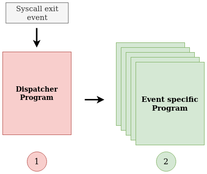

# New BPF probe proposal

## Summary

This document proposes a new BPF probe which will use the emerging tracing technologies to improve performance and usability. Besides this, the intention is to introduce [`CO-RE`](https://nakryiko.com/posts/bpf-portability-and-co-re/) paradigm, compiling once for all our supported kernel versions. The rationale is to embed the CO-RE probe directly inside `libscap`, thanks to a `C` header file generated by `bpftool`. Unfortunately, using these features requires fairly recent kernel versions (`>=5.8`).

## Motivation

This section explains the motivations behind this proposal.

#### 1. Why do we need a new probe?

The current probe supports old kernels (`>=4.14`) that can not take advantage of shiny new BPF features. So conditional compiling all this stuff into it would be useless: we should increase code size, reducing performance without having a real benefit! Moreover, supporting this vast range of kernel versions would require a major code complexity increasing the possibility of introducing new bugs. A new fresh probe seems the most reasonable solution.

#### 2. Which is the earliest supported kernel version, and why?

The target kernel version is `5.8` as it introduces a key data structure for improving performance: BPF `ring buffer`. This new map replaces the `perf buffer` struct allowing to take advantage of memory reservation strategies and more efficient APIs. As this feature will greatly influence design choices seems a great idea to start with the `5.8` version.

#### 3. What's new here?

1. Provide `CO-RE` support using `libbpf` as a BPF loader.
2. Use `ring buffer` map instead of `perf_buffer` one.
3. Use new `BPF_PROG_TYPE_TRACING` programs instead of actual `BPF_PROG_TYPE_RAW_TRACEPOINT`, to take full advantage of BTF-enabled features.
4. Use new efficient BPF maps: global variables.
5. Use `bpftool skeleton` to embed BPF bytecode directly into a `C` header file.
6. Provide complete support for `ARM64` architecture using `libbpf` facilities.
7. Introduce a robust testing phase for every BPF program injected into the kernel.
8. Design a more modular architecture with minimal code reuse.

All these topics are addressed in the [following section](#Focus).

## Focus

This section explains which are the main features involved and how to exploit them.

### CO-RE support

The new probe is 100% `CO-RE` compliant by design. The rationale behind this choice is quite clear:

* Avoid driver building for each different kernel version.
* Remove kernel headers requirement.
* Improve code efficiency and maintainability thanks to `libbpf` facilities.

The following resources explain well the importance of `CO-RE` approach and how to use it in the right way:

- [BPF CO-RE reference guide](https://nakryiko.com/posts/bpf-core-reference-guide/).
- [BPF CO-RE (Compile Once – Run Everywhere)](https://nakryiko.com/posts/bpf-portability-and-co-re/).

### BPF `ring buffer` map (Kernel version 5.8)

Today, whenever a BPF program needs to send collected data to user-space, it usually exploits the BPF `perf buffer` structure. The `perf buffer` is a collection of per-CPU circular buffers, which allows to efficiently exchange data between kernel and user-space. It works great in practice, but it has two major shortcomings that prove to be inconvenient in practice: **inefficient use of memory** and **extra data copying**.

#### 1. Inefficient use of memory

The `perf buffer` allocates a separate buffer for each CPU. This often means that BPF developers have to make a trade-off between allocating big enough per-CPU buffers (accommodating possible spikes of emitted data) or being memory-efficient, admitting some data drops. The `ring buffer` instead can be used as a multi-producer, single-consumer queue and can be safely shared across multiple CPUs simultaneously. In most cases, this would be the winning solution without any doubt. However, in our scenario, it becomes complex dealing with huge throughput of data (billions of events per second) and multiple fighting producers.
To better understand this issue, we can take a look at the following benchmark directly provided by BPF developers.

*Ringbuf, multi-producer contention*: single consumer and multiple producers using a single shared buffer.

```
nr_prod 1  10.916 ± 0.399M/s (drops 0.000 ± 0.000M/s)
nr_prod 2  4.931 ± 0.030M/s (drops 0.000 ± 0.000M/s)
nr_prod 3  4.880 ± 0.006M/s (drops 0.000 ± 0.000M/s)
nr_prod 4  3.926 ± 0.004M/s (drops 0.000 ± 0.000M/s)
nr_prod 8  4.011 ± 0.004M/s (drops 0.000 ± 0.000M/s)
nr_prod 12 3.967 ± 0.016M/s (drops 0.000 ± 0.000M/s)
nr_prod 16 2.604 ± 0.030M/s (drops 0.001 ± 0.002M/s)
nr_prod 20 2.233 ± 0.003M/s (drops 0.000 ± 0.000M/s)
nr_prod 24 2.085 ± 0.015M/s (drops 0.000 ± 0.000M/s)
nr_prod 28 2.055 ± 0.004M/s (drops 0.000 ± 0.000M/s)
nr_prod 32 1.962 ± 0.004M/s (drops 0.000 ± 0.000M/s)
nr_prod 36 2.089 ± 0.005M/s (drops 0.000 ± 0.000M/s)
nr_prod 40 2.118 ± 0.006M/s (drops 0.000 ± 0.000M/s)
nr_prod 44 2.105 ± 0.004M/s (drops 0.000 ± 0.000M/s)
nr_prod 48 2.120 ± 0.058M/s (drops 0.000 ± 0.001M/s)
nr_prod 52 2.074 ± 0.024M/s (drops 0.007 ± 0.014M/s)
```

Overall throughput drops almost `2x` when going from single to two highly-contended producers, gradually dropping with additional competing producers. Performance drop stabilizes at around `20` producers and hovers around `2 mln` even with `50+` fighting producers, which is a `5x` drop compared to non-contended cases. This contention issue is due to the fact that the `ring buffer` implementation uses a short-duration spinlock during the reservation phase.
Luckily, the `ring buffer` also provides a per-CPU approach like the `perf buffer`. So we still use a collection of circular buffers like in our current probe, but we can take advantage of better performance and better API (both kernel-side and user-side) provided by this new structure.

#### 2. Extra data copying

With the `perf buffer` approach, programs have to prepare a data sample before copying it into the buffer to send to user-space. This means that the same data has to be copied twice: first into a per-CPU map and then into the `perf buffer` itself. What's worse, all this work could be wasted if it turns out that `perf buffer` does not have enough space left in it!

The `ring buffer`, in addition to the mechanism already provided by the `perf buffer`, supports an alternative `reservation/submit` API to avoid this extra copy. It’s possible to first reserve the space into the buffer. If reservation succeeds, the BPF program can use that memory directly for preparing a data sample. Once done, submitting data to user-space is an extremely efficient operation. 
The only limitation of this reservation approach is that we need to know the event's size at load time, and unfortunately, this is not always possible in our case. Analyzing our [`event table`](https://github.com/falcosecurity/libs/blob/84470f1621d143c8cdc24fdf9bb4c5b87180ea6c/driver/event_table.c#L12), we have `63` events with variable size and about `165` with a fixed size. We can reserve space for fixed-size events while we still have to use extra copies for others.

A possible alternative for managing variable-size events with a reservation approach would be to gather data regarding event's distribution and create fine-grained tuned **buckets**. This seems a great workaround, but there are still some issues. Let's consider some of them:

1. To choose the right bucket for each event, we have to compute its real dimension at run-time, but this can have a not negligible cost. Some fields like pathnames need to be directly read from kernel memory to compute their real length. This requires a BPF map as extra temporary storage and additional time to perform the computation.

2. We can tune our buckets in a very meticulous way, but it is possible that different environments produce the same events with slightly different dimensions, causing a shift in a bucket with a greater dimension (maybe instead of reserve 2 KB we would use 4 KB). This excessive over-allocation could lead, in extreme cases, to a huge amount of drops since we are wasting precious space in our buffer.

In the end, the best approach seems to be reserving space only when it doesn't require further computations. For this reason, the capture of fixed-size events and variable-size ones will be managed in a slightly different way, as the [Architecture](#Architecture) paragraph will explain.

The following resources help to understand which are the strongest points of the `ring buffer` feature and when it is appropriate to use it:

- [BPF ring buffer concepts](https://nakryiko.com/posts/bpf-ringbuf/).
- [BPF ring buffer benchmarks](https://patchwork.ozlabs.org/project/netdev/patch/20200529075424.3139988-5-andriin@fb.com/).


### New BPF tracing programs (Kernel version 5.5)

Today, in our BPF probe, we use `BPF_PROG_TYPE_RAW_TRACEPOINT` programs to hook some kernel tracepoint like `syscall_exit` and `syscall_enter`. However, with the birth of new concepts like `BTF`, the BPF ecosystem provides a new program type: `BPF_PROG_TYPE_TRACING`. There are two main advantages related to this type:

1. Some helpers introduced in the most recent kernel versions can be used only by these programs and not by the old `BPF_PROG_TYPE_RAW_TRACEPOINT` ones. A simple example is the `bpf_d_path` helper that allows us to extract a file path starting from a file descriptor.

2. The second and more interesting advantage is the possibility to read kernel memory directly without helpers like `bpf_probe_read()`. The BPF verifier, which now understands and tracks `BTF` types natively, allows us to follow kernel pointers directly.

Here is an example to concretely understand what direct memory access means (also in terms of bytecode):

**`BPF_PROG_TYPE_RAW_TRACEPOINT` program**

```c
SEC("raw_tp/sys_exit")
int catch_syscall_exit_event(struct sys_exit_args *ctx)
{
	struct task_struct *t = (struct task_struct *)bpf_get_current_task();
	struct file * f; 
	int err = BPF_CORE_READ_INTO(&f, t, mm, exe_file);
	if(err < 0)
	{
		return 1;
	}
	return 0;
}	
```

**Bytecode**

```
int catch_syscall_exit_event(struct sys_exit_args * ctx):
; struct task_struct *t = (struct task_struct *)bpf_get_current_task();
   0: (85) call bpf_get_current_task#-61936
   1: (b7) r1 = 2192
   2: (0f) r0 += r1
   3: (bf) r1 = r10
; 
   4: (07) r1 += -16
; int err = BPF_CORE_READ_INTO(&f, t, mm, exe_file);
   5: (b7) r2 = 8
   6: (bf) r3 = r0
   7: (85) call bpf_probe_read_kernel#-64432
   8: (b7) r1 = 944
   9: (79) r3 = *(u64 *)(r10 -16)
  10: (0f) r3 += r1
  11: (bf) r1 = r10
; 
  12: (07) r1 += -8
; int err = BPF_CORE_READ_INTO(&f, t, mm, exe_file);
  13: (b7) r2 = 8
  14: (85) call bpf_probe_read_kernel#-64432
  15: (18) r1 = 0x80000000
; int err = BPF_CORE_READ_INTO(&f, t, mm, exe_file);
  17: (5f) r0 &= r1
; 
  18: (77) r0 >>= 31
; }
  19: (95) exit
```

**`BPF_PROG_TYPE_TRACING` program**


```c
SEC("tp_btf/sys_exit")
int catch_syscall_exit_event(struct sys_exit_args *ctx)
{
	struct task_struct *t = bpf_get_current_task_btf();
	struct file * f = t->mm->exe_file;
	if(!f)
	{
		return 1;
	}
	return 0;
}	
```

**Bytecode**


```
int catch_syscall_exit_event(struct sys_exit_args * ctx):
; struct task_struct *t = bpf_get_current_task_btf();
   0: (85) call bpf_get_current_task_btf#-61936
; struct file * f = t->mm->exe_file;
   1: (79) r1 = *(u64 *)(r0 +2192)
; struct file * f = t->mm->exe_file;
   2: (79) r1 = *(u64 *)(r1 +944)
   3: (b7) r0 = 1
; if(!f)
   4: (15) if r1 == 0x0 goto pc+1
   5: (b7) r0 = 0
; }
   6: (95) exit
```  

Instead of using the `BPF_CORE_READ_INTO()` macro, we can directly deference the `task_struct` pointer as in a C-like program. The direct access approach is not only clearer but, as we can see from the bytecode, is also definitely more efficient!

### Use of BPF `global variables` (Kernel version 5.5)

BPF `global variables` allow us to keep the BPF programs state in an efficient and straightforward way. User-space can directly change these variables without using `bpf` syscall, while BPF programs can retrieve an address to a map value without having to issue a helper call like `bpf_map_lookup_elem()`. In addition, we can also avoid preparing registers according to calling conventions and performing extra NULL-tests on the return value. All this means that we can significantly increase our performance in cases where we frequently pass data back-and-forth between in-kernel BPF code and user-space control code!
Last but not least, we could also take advantage of **read-only** global variables. User-space code can initialize these variables only before the loading phase so that they become invariants at verification time. This functionality allows the verifier to prune the dead code if the read-only value provably omits some code paths. A property like that is often desirable for some more advanced use cases, like dealing with various compatibility checks and extra configuration.

All that seems a great code improvement, but it is not just a matter of performance: using global variables, we could obtain a more natural C-like programming!
If you are curious, you can find more information about how global variables work in different kernel patch-set. These are some of the most relevant sources:

- https://lore.kernel.org/bpf/20190409212018.32423-1-daniel@iogearbox.net/
- https://lore.kernel.org/bpf/20191108042041.1549144-2-andriin@fb.com/

### Use BPF skeleton

BPF [`skeleton`](http://manpages.ubuntu.com/manpages/focal/man8/bpftool-gen.8.html#description) is an alternative interface to existing `libbpf` APIs for working with BPF objects. It is a `C` header file tailored to a specific input object file, reflecting its structure by listing out available maps, programs, and variables.
The `skeleton` allow to:

1. Remove the need to lookup mentioned components by name. They are populated in skeleton structure as valid `libbpf` types and can be passed to existing APIs. The rationale here is to provide simple and reliable access to BPF maps and programs.

2. Obtain an interface to global variables of all supported kinds: *mutable*, *read-only*, and *extern* ones. For *read-only* variables, this interface allows user-space programs to pre-setup initial values before BPF object is loaded and verified by the kernel. In all other cases, the interface directly provides a pointer to memory-mapped areas where the global variables are instantiated.

3. Generate a unique executable with the probe embedded in it. The skeleton, together with the APIs, directly contains BPF bytecode!  

### ARM64 support

The new probe will fully support `ARM64` architecture. `libbpf` greatly simplifies our work by providing a [series of macros](https://github.com/libbpf/libbpf/blob/3591deb9bc6b0848721f831790b78ae0a593b4c5/src/bpf_tracing.h#L140) tailored to a specific architecture. In addition to this, all new features like tracing programs, global variables, and the `ring buffer` are widely supported on ARM.

### Testing phase

We have tons of events, and new ones appear every day. Checking that everything is sent correctly to user-space becomes more and more difficult. The idea here is to separately inject every single BPF program into the kernel and assert that every generated event has exactly the number and type of parameters we expect! This approach should help us avoid errors due to oversights or misunderstandings of the syscall's correct behavior. Adding a testing phase will also help us identify code which is silently dropping events due to misconfiguration or incorrect run-time checks.

### Architecture

As previously said in the `ring buffer` [section](#BPF-ring-buffer-map-Kernel-version-58), our probe generates two kinds of events: **fixed-size** and **variable-size**. Each event type follows its own flow: 

1. **Fixed-size events**: we directly reserve space in the `ring buffer`.
2. **Variable-size events**: we use an auxiliary map before pushing data into the buffer.

#### Fixed-size events

Let's first consider the flow for fixed-size events, using the `close` exit event as an example. 
We have two different BPF programs involved:

<p align="center">
    
</p>

The first program [1] is a sort of dispatcher which perform mainly the following actions:

1. Get info about the incoming syscall.
2. Check if the capture is enabled user-space side.
3. Check if we are on 32-bit architecture.
4. Check if the event must be dropped.
5. Call the event-specific program in tail call.

This pseudo-code should help us in investigating what happens during the dispatching phase:

```c
SEC("tp_btf/sys_exit")
int BPF_PROG(catch_syscall_exit_event,
	     struct pt_regs *regs,
	     long ret)
{
    
    /* Get info about the incoming syscall. */
    struct syscall_evt_pair event_pair = get_event_pair(id);

    /* Check if the capture is enabled user-space side. */
    if(!capture_enabled())
    {
         return 0;
    }
    
    /* Check if we are on 32 bit architecture. */
    if(check_ia32())
    {
         return 0;
    }

    /* Check if the event must be dropped. */
    if(check_dropping_mode(&event_pair))
    {
         return 0;
    }

    /* Call the event-specific program in tail call. */
    bpf_tail_call(ctx, &tail_table, event_pair.exit_event);
}
```

On the other side of the tail call we have our event-specific BPF program [2].
Here we have to perform 3 steps:

1. Reserve space for our fixed-size event.
2. Fill this space with the event header and all parameters we have to catch.
3. Confirm that our data are ready to be used by user-space.


```c
SEC("tp_btf/sys_exit")
int BPF_PROG(ppme_syscall_close_x,
	     struct pt_regs *regs,
	     long ret)
{
	/* Reserve space for our fixed-size event. */
	struct ringbuf_space *reserved_space = get_reserved_space(CLOSE_EXIT_EVENT_SPACE);

	/* Fill this space with the event header and all parameters we have to catch for that event. */
	ringbuf_store_event_header(PPME_SYSCALL_CLOSE_X, reserved_space);

	/* In this `close` exit event, we have to catch just the return value. */
	
	/* 1° Parameter: ret (type: PT_ERRNO). */
	ringbuf_store_s64_param(ret, reserved_space);

	/* Confirm that our data are ready to be used by user-space. */
	commit_reserved_space(reserved_space);

	return 0;
}
```

#### Variable-size events

Also in the variable-size case, we have two BPF programs involved. The dispatcher program does not change: it is always the starting point for all our syscall exit events. The only change is in the event-specific program: we cannot directly reserve space in the `ring buffer`, so we have to use an auxiliary map.
This time we have to perform the following actions:

1. Get per-CPU auxiliary map.
2. Fill this map with the event header and all parameters we have to catch.
3. Copy the content of the map into the ring buffer and push it to user-space.

>__Note__: The only thing that is changed is the extra copy in a per CPU auxiliary map.

Let's take a look at how our event-specific pseudo-code changes, considering as an example the `open` exit event:

```c
SEC("tp_btf/sys_exit")
int BPF_PROG(ppme_syscall_open_x,
	     struct pt_regs *regs,
	     long ret)
{
	unsigned long sys_arg;

	/* Get per-CPU auxiliary map. */
	struct auxiliary_map *aux_map = get_auxiliary_map();
	
	/* Fill this map with the event header and all parameters we have to catch. */
	aux_map_store_event_header(PPME_SYSCALL_OPEN_X, aux_map); 

	/* 1° Parameter: ret (type: PT_FD) */
	aux_map_store_s64_param(ret, aux_map);

	/* 2° Parameter: name (type: PT_FSPATH) */
	unsigned long name = get_argument(regs, 0);
	aux_map_store_charbuf_param(name, aux_map);

	/* 3° Parameter: flags (type: PT_FLAGS32) */
	unsigned long flags = get_argument(regs, 1);
	aux_map_store_u32_param(open_flags_to_scap(sys_arg), aux_map);

	/* 4° Parameter: mode (type: PT_UINT32) */
	unsigned long mode = get_argument(regs, 2);
	aux_map_store_u32_param(open_modes_to_scap(flags, mode), aux_map);

	/* 5° Parameter: dev (type: PT_UINT32) */
	unsigned long dev = extract_dev_from_fd(ret);
	aux_map_store_u32_param(dev, aux_map);

	/* Copy the content of the map into the ring buffer and push it to user-space. */
	copy_aux_map_into_ringbuf(aux_map);

	return 0;
}
```

> __NOTE__: In these code snippets, we considered syscall exit events, but the same architecture is valid for all other types of events, syscall enter, page-faults, context-switches, ...

## User-facing changes

These are some of the questions that may naturally arise when a change occurs, so let's address them!

### 1. Is there anything supported by our drivers that won't work on the new probe?

No, the idea is to first achieve feature parity with actual drivers, leaving all functionalities like they are.

### 2. Is there any new feature for users?

No, as previously said, nothing will change from this point of view. The main goal is to have a significant boost in performance and stability. Obviously, the introduction of a more flexible and solid architecture will easily allow us to add new features once a certain degree of awareness has been achieved. Take into consideration that adding new features is always a great achievement, but in our specific scenario, we have to deal with huge amounts of data, so it is always good to move carefully through this thorny path!

### 3. Will I have to deploy Falco differently now?

No, your deploying strategy will remain the same. You can just deploy Falco with your `Helm` chart or whatever your favorite method is and let it do its magic without any additional worries. But there is one important good news about installation requirements: there will be no more issues with **missing drivers** for your kernel or painful local builds requiring the much-loved **KERNEL HEADERS**. Yes, you got it right. You do not need anymore to download drivers or build them since our new probe will be self-contained inside Falco! Doesn't it sound great?

## Requirements

1. The first supported kernel version is `5.8`, where the BPF `ring_buffer` map was introduced.
2. To use modern tracing features, we need a kernel with BTF exposed. Please note that here we cannot use solutions like [BTFHub](https://github.com/aquasecurity/btfhub) since when we try to access kernel memory directly, the verifier must check kernel BTF information to allow it. The verifier could not rely on external BTF sources like `libbpf` does since they could be tainted. `libbpf` library can use BTF provided with external paths as it performs only CO-RE relocations!

By the way, [Recent Linux distributions](https://github.com/libbpf/libbpf#bpf-co-re-compile-once--run-everywhere) come with kernel BTF already built-in, so using kernel versions greater than `5.8`, we should have no troubles with this requirement.

## Final goals

To summarize, the final goals of this proposal are:

1. To provide a single `CO-RE` compliant BPF probe using `libbpf` as a loader. No more **kernel-specific drivers**, and no more **kernel header** requirements.
2. To obtain a consistent **boost in performance** using modern tracing features and modernizing our current architecture.
3. To **fully support** `ARM64` architecture.
4. To simplify the codebase allowing better code maintainability and **more contributions** from the community.
5. To introduce a solid **testing phase** for every BPF program injected in the kernel.
6. To provide complete compatibility with the actual `libscap` event format.